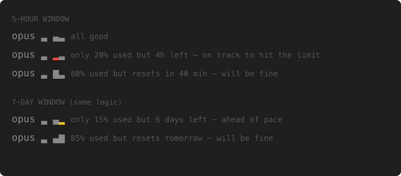

# minimal-claude-code-statusline

A minimal, pace-aware status line for [Claude Code](https://docs.anthropic.com/en/docs/claude-code). Shows model, context window, and API quota usage in a few characters.

Designed to stay out of your way — everything is gray and quiet when things are fine. You'll only notice it when a bar turns yellow or red, which is exactly when you need to.

```
opus ▃ ▄▃
│    │ ││
│    │ │└─ 7-day quota (height = usage %, color = pace)
│    │ └── 5-hour quota (height = usage %, color = pace)
│    └──── context window (height + color = usage %)
│
└───────── model name
```

## Examples



## Colors

**Context window** — absolute thresholds (finite window, not a rate):

| Usage | Color | Meaning |
|-------|-------|---------|
| < 50% | gray | Plenty of room |
| 50-79% | yellow | Getting full |
| 80%+ | red | Almost out |

**5-hour and 7-day quotas** — pace-aware coloring on absolute height:

```
pace_delta = utilization% - elapsed% of current window
```

| Pace delta | Color | Meaning |
|------------|-------|---------|
| ≤ 10% | gray | On pace, you'll fit |
| 11-30% | yellow | Ahead of pace, watch it |
| > 30% | red | Way ahead, slow down |

Bar height always shows absolute utilization. A tall gray bar means "almost full but resetting soon". A tall red bar means "almost full AND burning too fast".

## Requirements

- macOS (uses Keychain, `date -jf`, `stat -f%m`)
- `jq` and `curl`
- Claude Code with OAuth login

## Install

```bash
cp statusline.sh ~/.claude/statusline.sh
chmod +x ~/.claude/statusline.sh
```

Add to `~/.claude/settings.json`:

```json
{
  "statusLine": {
    "type": "command",
    "command": "~/.claude/statusline.sh"
  }
}
```

Restart Claude Code.

## How it works

1. Claude Code pipes JSON to the script on each render (contains `model.id` and `context_window.used_percentage`).
2. The script fetches quota data from `api.anthropic.com/api/oauth/usage`, cached for 1 minute at `~/.cache/claude-usage.json`.
3. The OAuth token is read from macOS Keychain (`Claude Code-credentials`).

The 1-minute cache means a burst of parallel agents can burn through quota before the statusline updates. The absolute bar height helps — if you see tall bars, tread carefully even if they're gray.

## License

MIT
